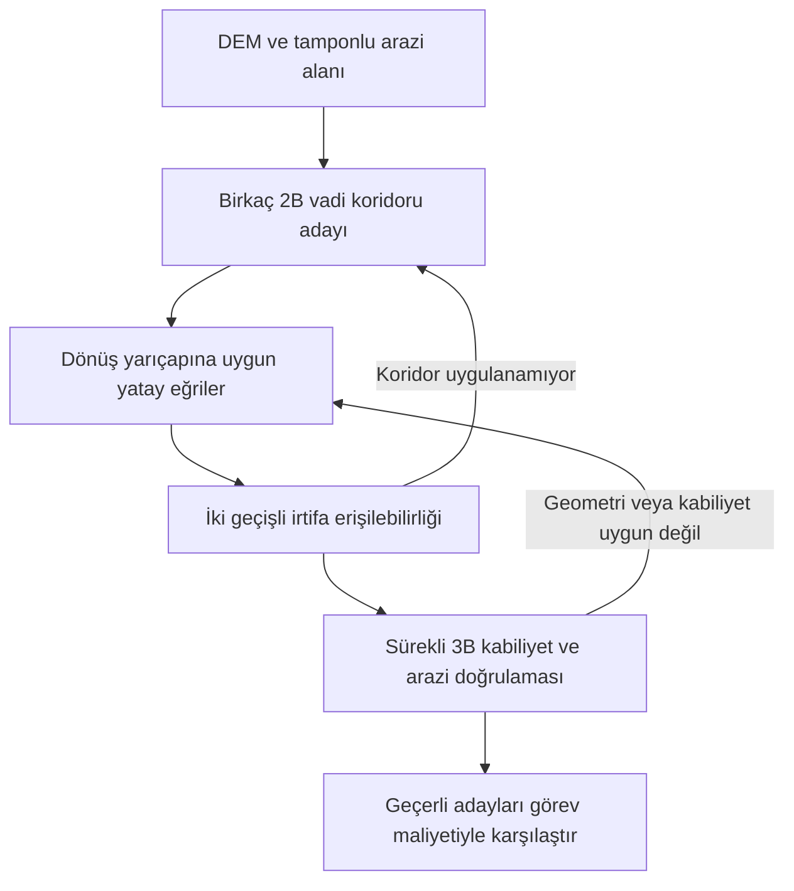

# Sabit kanat için arazi takibi: neden düz uçuyor, nasıl düzeltiliyor?

## Sonuç ve uygulanan kapsam

Mevcut geometrik arama, araziye yaklaşmayı amaçlamadığı için güvenli bir sabit irtifayı koruyor. Dikey hareketler mevcut; eksik olan, alçak uçuşun açık bir planlama amacı olması ve bu amacın ölçeklenebilir bir irtifa zamanlamasına dönüştürülmesi.

Bu değişiklikteki çözüm, bulunan yatay rotanın üzerinde tırmanma ve alçalma sınırlarını sağlayan bir irtifa profili hesaplar. İlerideki sırtları rotanın tamamında değerlendirir; gerekli tırmanışı önceden başlatır, yeterli mesafe olan çukurlarda alçalır. Hedef açıklık bir tercihtir; sert arazi tamponu ve uçak kabiliyeti her zaman bağlayıcıdır.

İki kapsamı ayrı değerlendirmek gerekir:

| Bileşen | Bu uygulamanın kapsamı |
|---|---|
| Bulunan yatay rotada irtifa takibi | Uygulanır; `optimize_terrain_following_altitudes` |
| Mevcut A* aramasından sonra bu profili üretmek | Uygulanır; `plan_terrain_following` |
| Başka bir vadiyi seçmek, sırtı yataydan dolaşmak | Aşağıda önerilen sonraki mimari aşama |
| Bütün sürekli 3B uzayda küresel en iyi NOE rotası | Bu uygulamanın garantisi değildir |

İrtifa iyileştiricisinin optimalite iddiası, **seçilmiş yatay rota, ayrık örnekler, arazi alt sınırları ve kullanılan muhafazakâr hız sınırları** içindir. Yatay rota seçimi aynı optimizasyonun içinde değildir.

## 1. Kodda görülen nedenler

### Geometrik maliyet alçalmayı ödüllendirmiyor

[`planner/pose_search.py`](../planner/pose_search.py) içindeki `_trajectory_edge_cost`, alçak uçuş maliyeti kapalıyken yalnızca 3B yol uzunluğunu döndürür. [`planner/config.py`](../planner/config.py) varsayılanları şöyledir:

```python
enable_low_altitude_cost = False
lambda_agl = 0.0
max_agl_cost_multiplier = 1.0
```

Bayrağı tek başına açmak da bu ağırlıklarla davranışı değiştirmez. Aynı yükseklikteki başlangıç ve hedef arasında düz, güvenli bir rota varsa vadiye inip tekrar yükselmek yolu uzatır. Başlangıç ve hedef yüksekliği farklı olduğunda gerekli toplam alçalma zaten vardır; geometrik maliyet bunun rotanın neresinde yapılacağını araziye yakınlık açısından değerlendirmez.

`_candidate_trajectories`, `STRAIGHT_CLIMB` ve `STRAIGHT_DESCENT` üretir. Dolayısıyla sorun genel olarak bir `z` hareketinin eksik olması değildir. Ayrıca 60 m hareketin yüksek irtifadaki yaklaşık 3,2 m tırmanışı, 5 m irtifa kovası içinde düz uçuşla birleşebilir. Bir kovada tek fiziksel temsilci tutulması bazı dikey seçenekleri kaybettiren ek bir yaklaşıklıktır.

### Deneysel aramalar üretim aramasından ayrı

[`experiments/authoritative_search_audit.py`](../experiments/authoritative_search_audit.py) kendi `run_live_search` döngüsünü kullanır. Bu döngüde geometrik maliyet ve hedef irtifasına göre Pareto elemesi ayrıca yazılmıştır. `pose_search.py` içindeki maliyet ayarının değişmesi, bu bağımsız deneysel aramayı kendiliğinden değiştirmez. Bir şeklin hangi giriş noktasından üretildiği bu yüzden raporda açık olmalıdır.

### Genel sabit kanat kinematiği modeli

[`planner/fixed_wing_envelope.py`](../planner/fixed_wing_envelope.py), 40 m/s yatay hız, ±5.0 m/s tırmanma/alçalma hızları ve 25° yatış açısına (R ≈ 349.9 m) dayanan tekil ve tutarlı bir sabit kanat kinematik zarfı sunar.

`climb_slope = 0.125`, 40 m/s yatay hızda 5 m/s dikey hıza denk gelir ve her 60 m ilkel adımında tam ±7.5 m irtifa değişimi üretir. İrtifa profili çözücüsü ve arazi takip optimizasyonu bu ortak kinematik modeli kullanır.

## 2. Maliyet ve sezgisel tahmin: matematiksel düzeltme

### Pozitif AGL cezası Öklid alt sınırını bozmaz

Bir kenarın sürekli fiziksel eğrisi `e`, 3B yay uzunluğu elemanı `dℓ`, tamponlu arazi yüksekliği `T_B` ve hedef açıklık `A_t` olsun. Alçak uçuş için örnek bir maliyet:

\[
C(e)=\int_e \left[1+\lambda\,
\phi\left(\frac{\max(0,z-T_B-A_t)}{H}\right)\right]d\ell,
\qquad \lambda\geq0,\ H>0,\ \phi(u)\geq0.
\]

`φ(u)=u` doğrusal, `φ(u)=u²` karesel tercih verir. Maliyeti mesafeyle bütünlemek önemlidir: kenar başına sabit bir irtifa cezası eklemek, aynı fiziksel yolun kaç parçaya ayrıldığına göre sonucu değiştirir. Negatif ödül gerekmiyor; yüksek uçuşa negatif olmayan ek maliyet yeterlidir.

Bu formülde `C(e) ≥ length(e) ≥ ||p-q||`. `G`, konumsal hedef tolerans bölgesi veya bu bölgeyi kapsayan bir gevşetme olsun:

\[
h(p)=\operatorname{dist}(p,G),\qquad h(g)=0\quad(g\in G).
\]

Üçgen eşitsizliğinden:

\[
h(p)\leq\|p-q\|+h(q)\leq C(p,q)+h(q).
\]

Bu, tutarlılık koşuludur; hedefe giden kenarlar boyunca uygulandığında alt sınır olma özelliğini de verir. Dolayısıyla negatif olmayan AGL cezası eklemek geometrik sezgiseli geçersiz yapmaz. Tutarlılık ve kabul edilebilirlik tanımları için [CMU arama ders notları](https://www.cs.cmu.edu/~15281/coursenotes/search/index.html).

Üretimdeki `_heuristic`, XY toleransı için hedef silindirini kapsayan bir kutuya uzaklık hesaplar; yön kısıtını da yok sayar. Bu gevşetmeler alt sınırı zayıflatır ama yukarıdaki eşitsizliği bozmaz.

### Peki arama neden büyüyor?

Yeni irtifa cezası `g` maliyetini artırırken geometrik `h`, kalan zorunlu irtifa maliyetini tahmin etmez. Birçok farklı dikey zamanlama benzer öncelik alır; daha çok durum incelenir. Bu bir sezgisel zayıflık ve durum temsili sorunudur. Sabit koridorda irtifa profilini doğrudan çözmek, bu dikey dallanmayı kaldırır.

Sert arazi denetimi korunuyorsa bir maliyet cezası tek başına kabul edilmiş bir arazi çarpışması üretmez. Gereksiz alçalma, daha sonra çıkılamayan durumların araştırılmasına ve arama bütçesinin bitmesine neden olabilir. Güvenli profil bulunamaması, güvenli olmayan bir profilin kabul edilmesiyle aynı sonuç değildir.

### Weighted A* ve nicemleme sınırı

`f=g+w h`, `w>1` kullanımı kesin en düşük maliyeti hedefleyen standart A* ile aynı garantiye sahip değildir. Alt optimalite sınırları, kullanılan algoritmanın durum grafiği, yeniden açma ve sonlandırma koşullarıyla birlikte değerlendirilir. Sürekli fiziksel durumları tek temsilcili kovalarla birleştirmek ve ayrıca irtifalar arasında eleme yapmak, ideal grafikteki teoremleri doğrudan uygulamaya taşımayı engeller.

## 3. Sabit rota üzerinde iki geçişli irtifa çözümü

### Geometri ve güvenli arazi alt sınırı

Yatay rota üzerindeki örnekler `i=0…N`, gerçek yatay yay mesafeleri `s_i` olsun. Zaman farkı:

\[
\Delta s_i=s_{i+1}-s_i,\qquad
\Delta t_i=\frac{\Delta s_i}{40}.
\]

Dönüşlerde mesafe, iki örnek arasındaki kiriş değil yayın uzunluğudur. Mevcut modelin 40 m/s sözleşmesi yatay hızdır.

Her örnek aralığının kapladığı DEM hücreleri, mevcut güvenlik denetimiyle aynı yanal tampon ve eğriden kirişe sapma hesabıyla bulunur. Segmentin muhafazakâr arazi maksimumu `T_i` ise sert sınır:

\[
L_i=T_i+A_{\min}.
\]

Bu sınır segmentin **iki ucuna da** uygulanır. Böylece segment içinde doğrusal irtifa değişirken en düşük uç irtifası bile kaplanan araziyi temizler. Yalnız merkez çizgisi üzerinde birkaç interpolasyon örneği almak aynı güvenlik sözleşmesini sağlamaz. NoData ve DEM dışına taşan tampon geçerli arazi sayılmaz.

### Dikey hız bütçeleri

Görev üst sınırları `+2,1 m/s` ve `−4,2 m/s` olarak uygulanır; kabiliyet tablosu daha düşük bir değer veriyorsa düşük olan kullanılır:

\[
c_i=\frac{\min(2.1,v_{\mathrm{climb,LUT},i})}{40},\qquad
d_i=\frac{\min(4.2,|v_{\mathrm{descent,LUT},i}|)}{40}.
\]

`c_i` ve `d_i` sırasıyla en büyük pozitif tırmanma ve alçalma eğimleridir. Bir hareket birden fazla kabiliyet bandından geçiyorsa geçilen aralık için muhafazakâr limit gerekir; yalnız ilk örnekteki tablo değeri yeterli değildir. Kullanılamayan manevra için pozitif bir kabiliyet uydurulmaz.

Uygulama önce görev üst sınırlarıyla çözüm üretir, geçilen irtifa bantlarının tablodaki limitlerini kontrol eder ve gerekirse ilgili mesafe bütçelerini daraltıp yeniden çözer. Bu işlem `max_refinement_passes` ile sınırlıdır; sınırda yakınsamayan profil başarı olarak dönmez. Daraltmalar muhafazakâr olduğu için başarısızlık, seçilen rota ve kullanılan bütçelere ilişkindir; bütün olası uçuşların olanaksız olduğunu kanıtlamaz.

Kısıtlar:

\[
-d_i\Delta s_i\leq z_{i+1}-z_i\leq c_i\Delta s_i.
\]

BASIC dönüş segmentleri düz irtifada korunur: bu segmentlerde `c_i=d_i=0`. Var olan düz dönüş yayına yalnızca değişen `z` eklemek, daha büyük yarıçap gerektiren birleşik dönüş modelini doğrulamaz. Dönüşte tırmanma istenirse yatay geometri de `combined_turn` sınırlarıyla yeniden üretilmelidir.

### Hedef açıklık yumuşaktır

Örneğin sert açıklık 100 m iken hedef 120 m olabilir. Hedefin başlangıç veya bitiş koşullarını olanaksızlaştırmasına izin verilmez. Verilen hız bütçeleriyle başlangıç ve bitişten kaynaklanan üst erişilebilirlik sınırları:

\[
U_i=\min\left(
z_0+\sum_{k=0}^{i-1}c_k\Delta s_k,
z_N+\sum_{k=i}^{N-1}d_k\Delta s_k
\right).
\]

İlk terim başlangıçtan ne kadar yükselinebildiğini, ikinci terim o noktadan hedefe ne kadar alçalarak erişilebildiğini sınırlar. Sert arazi alt sınırı `L_i` korunarak tercih tabanı şu şekilde sınırlandırılabilir:

\[
F_i=\max\left(L_i,\min(T_{B,i}+A_t,U_i)\right).
\]

Burada `L_i`, komşu segmentlerin uçta gerektirdiği en büyük sert sınırı içerir. `L_i>U_i` ise seçilen rota ve hız bütçeleri altında fiziksel çözüm yoktur. Başlangıç ve bitişte `F_0=z_0`, `F_N=z_N` sabitlenir; bunların sert tabanı sağlaması gerekir.

Bu işlem 120 m tercihini gerekirse 100 m sert sınıra doğru gevşetir. Bir sırtı aşmak veya yüksek hedefe yetişmek için gerekli fazla AGL ise erişilebilirlik çözümünde korunur. Her noktayı zorla `100–150 m` koridoruna hapsetmez.

### Geri geçiş: ilerideki yüksekliğe yetişmek

\[
B_N=F_N,
\qquad
B_i=\max\left(F_i,B_{i+1}-c_i\Delta s_i\right).
\]

İlerideki bir sırtın gerektirdiği yükseklik, tırmanma kabiliyeti kadar azaltılarak geriye yayılır. Bu, bütün rota için gerekli erken tırmanışı hesaplar. Keyfî bir 2 km ufkun dışındaki yüksek araziyi unutmaz.

### İleri geçiş: gereğinden hızlı alçalmamak

\[
z_0=B_0,
\qquad
z_{i+1}=\max\left(B_{i+1},z_i-d_i\Delta s_i\right).
\]

Önceki yüksekliğin gerektirdiği alçalma mesafesi ileriye yayılır. Dar bir çukurda profil, uçak o çukuru fiziksel olarak takip edemiyorsa yüksek kalır. İki geçiş sonunda başlangıç veya bitiş irtifası sabit değerinden yukarı taşınmışsa rota bu koşullarda uygulanabilir değildir.

Özet sözde kod:

```python
backward = floor.copy()
for i in range(n - 2, -1, -1):
    backward[i] = max(floor[i], backward[i + 1] - climb_budget[i])

z = backward.copy()
for i in range(n - 1):
    z[i + 1] = max(backward[i + 1], z[i] - descent_budget[i])

if z[0] > fixed_start_z + eps or z[-1] > fixed_end_z + eps:
    return infeasible
```

Her geçişin yükselttiği değer, herhangi bir geçerli profilin en az sağlaması gereken bir alt sınırdır. Geri geçiş tırmanışı, ileri geçiş alçalmayı sağlar; ileri geçişin yükseltmeleri tırmanış eşitsizliğini de korur. Sonuç, sabit bütçeler ve seçilmiş `F` tabanı için noktasal olarak en düşük profildir. Bu sonuç, ayrıca yol uzunluğunu ağırlıklandıran genel bir 3B maliyetin küresel minimumu olduğunu söylemez.

### Son doğrulama

Hesaplanan irtifalar gerçek `PhysicalTrajectory` örneklerine yazılır. Dikey hız, irtifa bandındaki kabiliyet, başlangıç/bitiş devamlılığı ve bütün segmentlerin mevcut arazi güvenlik denetimi tekrar doğrulanır. Başarısız bir irtifa düzenlemesi başarılı arazi takibi olarak sunulmaz. Bu model, ani dikey hız değişimlerine ilişkin ivme veya uçuş kontrol dinamiği çözmez; mevcut birinci mertebe kinematik sözleşmeyi kullanır.

## 4. Kullanım

Bulunmuş bir rotanın yatay izini koruyarak irtifa profili üretmek:

```python
from dataclasses import replace

from planner.config import DEFAULT_CONFIG
from planner.terrain_following import optimize_terrain_following_altitudes

config = replace(
    DEFAULT_CONFIG,
    min_agl_m=100.0,
    lateral_buffer_m=60.0,
    primitive_sample_spacing_m=10.0,
)

profile_result = optimize_terrain_following_altitudes(
    search_result.trajectories,
    terrain,
    aircraft_profile,
    config=config,
    target_agl_m=120.0,
)

if profile_result.success:
    flight_trajectories = profile_result.trajectories
else:
    print(profile_result.status)
```

Arama ve irtifa çözümünü birlikte çağırmak:

```python
from planner.terrain_following import plan_terrain_following

result = plan_terrain_following(
    start,
    goal,
    terrain,
    aircraft_profile,
    goal_tolerance=goal_tolerance,
    config=config,
    target_agl_m=120.0,
)

# Aramanın ve irtifa çözümünün sonuçları ayrı incelenebilir.
search_result = result.search_result
profile_result = result.profile_result
```

`terrain`, `aircraft_profile`, `start`, `goal` ve `goal_tolerance`, mevcut planlayıcıda kullanılan nesnelerdir. `search_result` kendi özgün fiziksel zincirini ve arama istatistiklerini tutar. İrtifa çözümünün geçerli çıktısı `profile_result.trajectories` üzerinden alınır; arama yolu ile son uçuş profili ölçümleri karıştırılmamalıdır. Hedef toleransında kabul edilmiş mevcut yol düzenlenirken o yolun gerçek başlangıç ve bitiş irtifaları korunur.

## 5. Tam vadi rotası için sonraki mimari

Yatay rota bir tepenin üzerinden geçiyorsa irtifa iyileştiricisi o tepenin yanında daha iyi bir vadi bulunduğunu keşfetmez. Bunun için önerilen akış:



### Topografik alanın görevi

Dijkstra veya Fast Marching için örnek bir pozitif 2B yoğunluk:

\[
W(x,y)=1+
\alpha\frac{\max(0,T_B(x,y)-T_{\mathrm{ref}})}{H_T}
+\beta\,r(x,y),\qquad \alpha,\beta\geq0,
\]

`r`, sırt veya keskin arazi değişimi için görevce seçilmiş bir ölçüdür. Alan ve hedefe uzaklık haritası aynı DEM/tampon için önceden hesaplanıp yeniden kullanılabilir. Birkaç farklı koridor, tek bir iskelete kilitlenmenin önüne geçer.

Vadi tabanını tercih etmek ile her rotada aynı düşük AGL'yi tutmak farklı amaçlardır: hem alçak vadide hem yüksek platoda 120 m AGL mümkündür. Alçak MSL veya sırt geçişini azaltma tercihi isteniyorsa bu tercih son adayları karşılaştıran görev maliyetinde de açık olmalıdır. Yalnız arama rehberine eklenmiş bir ceza, son maliyetin aynı tercihi optimize ettiğini kanıtlamaz.

### Dijkstra sonucu otomatik olarak geçerli 3B sezgisel değildir

Sekiz komşulu bir gridde `(0,0)` ile `(2,1)` arasındaki en kısa yol `1+sqrt(2)` uzunluğundadır; sürekli düz çizgi `sqrt(5)` uzunluğundadır. İlki daha büyüktür. Böylece engel bulunmasa bile grid mesafesi sürekli hareketin maliyetini aşabilir. Muhafazakâr hücre kapatma veya farklı topografik maliyet kullanmak da ek fazla tahmin üretebilir.

Kanıtlı alt sınır isteniyorsa bir gevşetilmiş grafik tasarlanmalıdır. Fiziksel durumdan gevşetilmiş duruma bir `π` eşlemesi için şu koşullar yeterlidir:

1. Her fiziksel kenar `p→q`, gevşetilmiş grafikte `π(p)→π(q)` yoluyla temsil edilebilir.
2. Bu temsilin maliyeti fiziksel kenarın maliyetini aşmaz.
3. Her fiziksel hedef gevşetilmiş hedef kümesine eşlenir.

Gevşetilmiş grafikte tam hedef uzaklığı `D` hesaplanırsa:

\[
h_R(p)=D(\pi(p))
\leq C_R(\pi(p)\leadsto\pi(q))+D(\pi(q))
\leq C(p,q)+h_R(q).
\]

Bu, tutarlılık için gereken somut kanıttır. DEM gridine Dijkstra çalıştırmak tek başına bu eşlemeyi kurmaz. Kanıt mevcutsa `max(h_geom, h_R)` gibi alt sınırların maksimumu kullanılabilir; çakışan maliyet bileşenleri kanıtsız biçimde toplanmamalıdır.

Kanıtlanmış alt sınır olmayan topografik alan, koridor üretimi veya ek arama yönlendirmesi olarak kullanılabilir. MHA*, bir tutarlı ana sezgiselin yanında alt sınır olması gerekmeyen ek sezgiselleri ayrı kuyruklarda kullanmak için geliştirilmiştir. Garantiler makaledeki kuyruk, eleme ve durum grafiği koşullarıyla birlikte geçerlidir; mevcut tek temsilcili sürekli durum birleştirmesi ayrıca değerlendirilmelidir. [Aine ve diğerleri, Multi-Heuristic A*, RSS 2014](https://www.cs.cmu.edu/~venkatrn/papers/rss14.pdf).

### İskeletin kinematik uygulanabilirliği

2B griddeki keskin köşeler uçuş rotası değildir. Koridor genişliği ve gerçek irtifadaki dönüş yarıçapları kullanılarak sürekli dönüşler kurulmalı, ardından irtifa çözümü çalıştırılmalıdır. İrtifa çözümü başarısızsa erken tırmanmak için daha uzun yol, sırtı dolaşan başka koridor veya farklı dönüş geometrisi gerekir. Uygulanabilirliğin güvencesi iskelet üretiminden değil, son fiziksel yolun denetiminden gelir.

## 6. İrtifa durumlarını eleme politikası

`(g, |z-z_goal|)` veya `(g, AGL)` üzerinden farklı irtifaları elemek genel olarak geçerli değildir. Aynı XY ve yönde aşağıdaki iki durum birbirinin yerine geçmez:

- Alçak durum, düz arazide düşük uçuş için iyi olabilir; yaklaşan sırtı aşmaya yetişemeyebilir.
- Yüksek durum, daha düşük maliyetli bir alçak durum varken bile ilerideki geçidi aşmak için gerekli olabilir.

Geçerli eleme, elenen durumun her yararlı devamının kalan durumdan en fazla aynı toplam maliyetle yapılabildiğini gerektirir. Yalnız hedef irtifasına yakınlık bunu göstermez. Sabit rotada iki geçişli çözüm, irtifayı ayrı bir dallanma boyutu olmaktan çıkararak bu eleme ihtiyacını azaltır.

Tam 3B aramada seçenekler: fiziksel olarak aynı durumlar arasında düşük `g` elemesi, kanıtlanmış erişilebilirlik eşdeğerliği veya açıkça yaklaşık olarak raporlanan çoklu temsilci politikasıdır. Kova başına birkaç temsilci tutmak kayıpları azaltabilir; sınırlı sayıda temsilci tutmak tek başına tamlık veya küresel optimalite kanıtı sağlamaz. Gerekli yüksek irtifa durumlarının korunması ayrı bir doğrulama senaryosu olmalıdır.

## 7. Ölçeklenebilirlik ve değerlendirme

İrtifa zarfının iki geçişi `N` örnek için `O(N)` zaman ve bellek kullanır; yeni A* düğümü üretmez. Kabiliyet bütçelerinin `K` kez daraltılması gerekirse profil çözümü `O(KN)` olur; `K` uygulamada sınırlıdır. DEM kapsama hesabı ve kabiliyet doğrulaması da toplam süreye dahildir. Yanal tampon alanı aynı arazi için önbelleğe alınabilir. Yatay aramanın maliyeti ise sürer.

`3–10 km görevlerde <1 saniye ve <2000 açılım` bir ölçüm hedefidir. Her arazi, uç koşulu, donanım ve koridor için mutlak bir garanti değildir. Rapor şu bileşenleri ayrı vermelidir:

- Yatay arama süresi ve açılım sayısı.
- İrtifa çözümü ve son doğrulama süresi.
- Uçtan uca süre; DEM yükleme ve tampon önbelleğinin dahil olup olmadığı.
- Minimum tamponlu açıklık, merkez çizgisi AGL istatistikleri ve hedef bantta geçirilen mesafe oranı.
- Gerçek en büyük tırmanma/alçalma hızı, irtifa aralığı ve başlangıç/bitiş hataları.
- Başarısız senaryoların nedeni; timeout ve uygulanamaz koridor ayrımı.

Temel senaryolar düz arazide erken alçalma, önce çukur sonra sırt, kısa ve derin vadi, yüksek hedefe erken tırmanma, BASIC dönüş boyunca düz irtifa ve NoData/tampon ihlalidir. Gerçek DEM sonuçları sentetik kısıt kontrolleriyle birlikte değerlendirilmelidir.
