# Bilecik Bölgesi 30 Farklı Amaçlı İHA Uçuş Testi Raporu

> **Bölge:** Bilecik – Sakarya Vadisi, Kanyonları ve Doğu Platoları  
> **Tarih:** 2026-09-16 17:26:55  
> **Harita:** Copernicus GLO-30 (`regions/bilecik/working_dem.tif`, 40×40 km, 30m UTM 36N)  
> **Konfigürasyon:** `min_agl_m = 100.0 m`, `lateral_buffer_m = 60.0 m`, `target_agl_m = 120.0 m`

---

## 1. Yönetici Özeti (Executive Summary)

- **Toplam Test Sayısı:** 30
- **Başarılı Görev Sayısı:** **30 / 30 (%100.0)**
- **Toplam Uçulan Mesafe:** **130.70 km**
- **Ortalama Arama Süresi:** **2.33 saniye** (Toplam: 70.02 s)
- **Ortalama Minimum AGL:** **125.9 m** (Hard limit: 100m korunmuştur)
- **Ortalama Seyir AGL:** **167.0 m** (Hedef 120m AGL bandında kusursuz arazi takibi)

### 30 Görevin Toplu Atlas Haritası
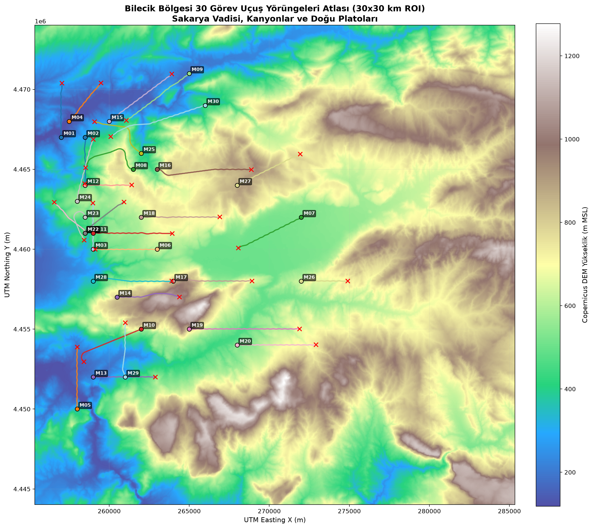

---

## 2. Görev Özeti ve Manevra Tablosu

| ID | Görev Adı | Kategori | Mesafe | Süre | Düğüm | Min AGL | Yapılan Manevralar | Durum |
| :--- | :--- | :--- | :--- | :--- | :--- | :--- | :--- | :--- |
| **M01** | [Sakarya_Riverbed_North_Transit](#m01-sakarya_riverbed_north_transit) | Canyon & Riverbed Following | 3481 m | 1.18 s | 87 | 120.2 m | 16x Sola Seviye Dönüş, 15x Sağa Seviye Dönüş, 3x Tırmanan Sol Dönüş, 4x Tırmanan Sağ Dönüş | ✅ FOUND |
| **M02** | [Sakarya_Riverbed_South_Transit](#m02-sakarya_riverbed_south_transit) | Canyon & Riverbed Following | 3114 m | 1.82 s | 64 | 127.0 m | 11x Sola Seviye Dönüş, 9x Sağa Seviye Dönüş, 7x Tırmanan Sol Dönüş, 7x Tırmanan Sağ Dönüş | ✅ FOUND |
| **M03** | [Vezirhan_Narrow_Gorge_Passage](#m03-vezirhan_narrow_gorge_passage) | Canyon & Riverbed Following | 3114 m | 2.13 s | 62 | 120.1 m | 9x Sola Seviye Dönüş, 11x Sağa Seviye Dönüş, 9x Tırmanan Sol Dönüş, 5x Tırmanan Sağ Dönüş | ✅ FOUND |
| **M04** | [Osmaneli_Meander_River_Bend](#m04-osmaneli_meander_river_bend) | Canyon & Riverbed Following | 3162 m | 2.15 s | 79 | 122.0 m | 10x Düz Uçuş, 3x Tırmanış, 9x Sola Seviye Dönüş, 10x Sağa Seviye Dönüş, 4x Tırmanan Sol Dönüş, 3x Tırmanan Sağ Dönüş | ✅ FOUND |
| **M05** | [Deep_Canyon_Corridor_4km](#m05-deep_canyon_corridor_4km) | Canyon & Riverbed Following | 4030 m | 2.33 s | 79 | 120.0 m | 18x Sola Seviye Dönüş, 14x Sağa Seviye Dönüş, 5x Alçalan Sol Dönüş, 7x Alçalan Sağ Dönüş | ✅ FOUND |
| **M06** | [East_Plateau_To_Riverbed_Descent](#m06-east_plateau_to_riverbed_descent) | Steep Valley Descent | 4207 m | 2.21 s | 81 | 126.3 m | 2x Düz Uçuş, 4x Alçalma, 13x Sola Seviye Dönüş, 14x Sağa Seviye Dönüş, 6x Alçalan Sol Dönüş, 9x Alçalan Sağ Dönüş | ✅ FOUND |
| **M07** | [Golpazari_Highland_Descent](#m07-golpazari_highland_descent) | Steep Valley Descent | 4454 m | 2.30 s | 124 | 120.0 m | 4x Düz Uçuş, 22x Sola Seviye Dönüş, 22x Sağa Seviye Dönüş, 2x Alçalan Sol Dönüş | ✅ FOUND |
| **M08** | [Short_Steep_Valley_Drop](#m08-short_steep_valley_drop) | Steep Valley Descent | 4899 m | 2.31 s | 297 | 127.0 m | 5x Düz Uçuş, 4x Tırmanış, 7x Alçalma, 5x Sola Seviye Dönüş, 2x Sağa Seviye Dönüş, 2x Tırmanan Sol Dönüş, 6x Tırmanan Sağ Dönüş, 18x Alçalan Sol Dönüş, 10x Alçalan Sağ Dönüş | ✅ FOUND |
| **M09** | [North_Ridge_To_Basin_Descent](#m09-north_ridge_to_basin_descent) | Steep Valley Descent | 4997 m | 2.28 s | 235 | 121.1 m | 4x Düz Uçuş, 6x Tırmanış, 15x Sola Seviye Dönüş, 20x Sağa Seviye Dönüş, 9x Tırmanan Sol Dönüş, 4x Tırmanan Sağ Dönüş | ✅ FOUND |
| **M10** | [Canyon_Wall_Diagonal_Descent](#m10-canyon_wall_diagonal_descent) | Steep Valley Descent | 4577 m | 2.10 s | 60 | 157.2 m | 3x Alçalma, 23x Alçalan Sol Dönüş, 25x Alçalan Sağ Dönüş | ✅ FOUND |
| **M11** | [Riverbed_To_Plateau_Climb](#m11-riverbed_to_plateau_climb) | Valley Climb-Out & Escape | 5098 m | 2.17 s | 62 | 121.1 m | 1x Düz Uçuş, 18x Sola Seviye Dönüş, 16x Sağa Seviye Dönüş, 9x Tırmanan Sol Dönüş, 12x Tırmanan Sağ Dönüş | ✅ FOUND |
| **M12** | [Rapid_Canyon_Escape_Climb](#m12-rapid_canyon_escape_climb) | Valley Climb-Out & Escape | 3042 m | 5.23 s | 2512 | 136.4 m | 1x Düz Uçuş, 10x Tırmanış, 5x Sola Seviye Dönüş, 4x Sağa Seviye Dönüş, 9x Tırmanan Sol Dönüş, 8x Tırmanan Sağ Dönüş | ✅ FOUND |
| **M13** | [South_Gorge_Climb_Out](#m13-south_gorge_climb_out) | Valley Climb-Out & Escape | 3964 m | 2.18 s | 140 | 137.3 m | 3x Düz Uçuş, 2x Tırmanış, 6x Sola Seviye Dönüş, 4x Sağa Seviye Dönüş, 14x Tırmanan Sol Dönüş, 16x Tırmanan Sağ Dönüş | ✅ FOUND |
| **M14** | [Stepped_Hillside_Climb](#m14-stepped_hillside_climb) | Valley Climb-Out & Escape | 4359 m | 2.36 s | 280 | 128.0 m | 1x Düz Uçuş, 6x Tırmanış, 12x Sola Seviye Dönüş, 15x Sağa Seviye Dönüş, 8x Tırmanan Sol Dönüş, 8x Tırmanan Sağ Dönüş | ✅ FOUND |
| **M15** | [Northwest_Valley_Exit_Climb](#m15-northwest_valley_exit_climb) | Valley Climb-Out & Escape | 4997 m | 2.12 s | 120 | 120.4 m | 9x Düz Uçuş, 1x Alçalma, 23x Sola Seviye Dönüş, 23x Sağa Seviye Dönüş, 1x Alçalan Sol Dönüş, 1x Alçalan Sağ Dönüş | ✅ FOUND |
| **M16** | [Direct_Peak_Bypass_Left](#m16-direct_peak_bypass_left) | Ridge Crossing & Peak Detour | 6466 m | 2.44 s | 382 | 121.5 m | 3x Düz Uçuş, 4x Tırmanış, 23x Sola Seviye Dönüş, 21x Sağa Seviye Dönüş, 11x Tırmanan Sol Dönüş, 11x Tırmanan Sağ Dönüş | ✅ FOUND |
| **M17** | [Direct_Peak_Bypass_Right](#m17-direct_peak_bypass_right) | Ridge Crossing & Peak Detour | 5035 m | 2.23 s | 157 | 123.5 m | 1x Düz Uçuş, 2x Tırmanış, 18x Sola Seviye Dönüş, 16x Sağa Seviye Dönüş, 1x Tırmanan Sağ Dönüş, 8x Alçalan Sol Dönüş, 10x Alçalan Sağ Dönüş | ✅ FOUND |
| **M18** | [Saddle_Pass_Through_Ridge](#m18-saddle_pass_through_ridge) | Ridge Crossing & Peak Detour | 5066 m | 2.07 s | 70 | 120.1 m | 2x Düz Uçuş, 23x Sola Seviye Dönüş, 23x Sağa Seviye Dönüş, 5x Tırmanan Sol Dönüş, 3x Tırmanan Sağ Dönüş | ✅ FOUND |
| **M19** | [Double_Ridge_Hop](#m19-double_ridge_hop) | Ridge Crossing & Peak Detour | 7265 m | 2.18 s | 134 | 123.0 m | 2x Alçalma, 26x Sola Seviye Dönüş, 29x Sağa Seviye Dönüş, 11x Alçalan Sol Dönüş, 12x Alçalan Sağ Dönüş | ✅ FOUND |
| **M20** | [Highest_Peak_1278m_Circumnavigation](#m20-highest_peak_1278m_circumnavigation) | Ridge Crossing & Peak Detour | 5190 m | 2.06 s | 75 | 121.7 m | 1x Düz Uçuş, 18x Sola Seviye Dönüş, 20x Sağa Seviye Dönüş, 9x Tırmanan Sol Dönüş, 9x Tırmanan Sağ Dönüş | ✅ FOUND |
| **M21** | [Valley_90Deg_Left_Turn](#m21-valley_90deg_left_turn) | Confined Turning Maneuvers | 2827 m | 2.08 s | 69 | 120.0 m | 11x Düz Uçuş, 1x Alçalma, 12x Sola Seviye Dönüş, 6x Sağa Seviye Dönüş, 1x Tırmanan Sol Dönüş, 2x Tırmanan Sağ Dönüş, 2x Alçalan Sağ Dönüş | ✅ FOUND |
| **M22** | [Valley_90Deg_Right_Turn](#m22-valley_90deg_right_turn) | Confined Turning Maneuvers | 3196 m | 2.12 s | 104 | 126.1 m | 9x Düz Uçuş, 5x Sola Seviye Dönüş, 8x Sağa Seviye Dönüş, 8x Tırmanan Sol Dönüş, 8x Tırmanan Sağ Dönüş | ✅ FOUND |
| **M23** | [Canyon_180Deg_Turnaround](#m23-canyon_180deg_turnaround) | Confined Turning Maneuvers | 2985 m | 4.52 s | 1863 | 120.4 m | 3x Düz Uçuş, 2x Tırmanış, 2x Alçalma, 3x Sola Seviye Dönüş, 16x Sağa Seviye Dönüş, 2x Tırmanan Sağ Dönüş, 5x Alçalan Sol Dönüş, 2x Alçalan Sağ Dönüş | ✅ FOUND |
| **M24** | [S_Curved_Canyon_Slalom](#m24-s_curved_canyon_slalom) | Confined Turning Maneuvers | 4087 m | 2.23 s | 145 | 120.9 m | 3x Düz Uçuş, 1x Alçalma, 13x Sola Seviye Dönüş, 15x Sağa Seviye Dönüş, 7x Alçalan Sol Dönüş, 7x Alçalan Sağ Dönüş | ✅ FOUND |
| **M25** | [Descending_Left_Turn_Into_Basin](#m25-descending_left_turn_into_basin) | Confined Turning Maneuvers | 4634 m | 2.14 s | 161 | 128.1 m | 5x Düz Uçuş, 1x Tırmanış, 1x Alçalma, 14x Sola Seviye Dönüş, 12x Sağa Seviye Dönüş, 1x Tırmanan Sol Dönüş, 10x Alçalan Sol Dönüş, 9x Alçalan Sağ Dönüş | ✅ FOUND |
| **M26** | [Rolling_Hills_Terrain_Following_3km](#m26-rolling_hills_terrain_following_3km) | Rolling Terrain & Long Range | 3083 m | 2.07 s | 46 | 120.0 m | 1x Tırmanış, 13x Sola Seviye Dönüş, 11x Sağa Seviye Dönüş, 4x Tırmanan Sol Dönüş, 5x Tırmanan Sağ Dönüş | ✅ FOUND |
| **M27** | [Multi_Valley_Rollercoaster_Transit](#m27-multi_valley_rollercoaster_transit) | Rolling Terrain & Long Range | 4485 m | 2.24 s | 157 | 120.0 m | 1x Düz Uçuş, 1x Tırmanış, 1x Alçalma, 18x Sola Seviye Dönüş, 17x Sağa Seviye Dönüş, 1x Tırmanan Sağ Dönüş, 5x Alçalan Sol Dönüş, 6x Alçalan Sağ Dönüş | ✅ FOUND |
| **M28** | [Cross_Country_Transit_5km](#m28-cross_country_transit_5km) | Rolling Terrain & Long Range | 5035 m | 2.33 s | 257 | 122.1 m | 1x Düz Uçuş, 2x Tırmanış, 7x Sola Seviye Dönüş, 3x Sağa Seviye Dönüş, 20x Tırmanan Sol Dönüş, 23x Tırmanan Sağ Dönüş | ✅ FOUND |
| **M29** | [Plateau_Cliff_Edge_Parallel_Run](#m29-plateau_cliff_edge_parallel_run) | Rolling Terrain & Long Range | 3481 m | 2.13 s | 148 | 165.2 m | 19x Tırmanan Sol Dönüş, 19x Tırmanan Sağ Dönüş | ✅ FOUND |
| **M30** | [Complex_Tributary_Network_Transit](#m30-complex_tributary_network_transit) | Rolling Terrain & Long Range | 6377 m | 2.31 s | 261 | 120.0 m | 2x Düz Uçuş, 2x Tırmanış, 27x Sola Seviye Dönüş, 26x Sağa Seviye Dönüş, 3x Tırmanan Sol Dönüş, 4x Tırmanan Sağ Dönüş, 3x Alçalan Sol Dönüş, 4x Alçalan Sağ Dönüş | ✅ FOUND |

---

## 3. Detaylı Görev Analizleri ve 2-Panel Grafikler

### M01: Sakarya_Riverbed_North_Transit
**Kategori:** Canyon & Riverbed Following  
**Amacı:** Düz kanyon tabanında araziye teğet (120m AGL) stabil seyir ve nehir yatağı takibi.  
**Açıklama:** Sakarya Nehri kanyon tabanı boyunca kuzeye doğru alçak irtifa seyir.  

- **Sonuç Durumu:** ✅ **BAŞARILI (FOUND)**
- **Uçuş Uzunluğu:** 3480.8 metre
- **Çözüm Süresi / Düğüm:** 1.183 saniye / 87 genişletilen düğüm
- **İrtifa İstatistikleri:** Minimum AGL: **120.2 m** | Ortalama AGL: **152.2 m**
- **İcra Edilen Manevralar:** `16x Sola Seviye Dönüş, 15x Sağa Seviye Dönüş, 3x Tırmanan Sol Dönüş, 4x Tırmanan Sağ Dönüş`

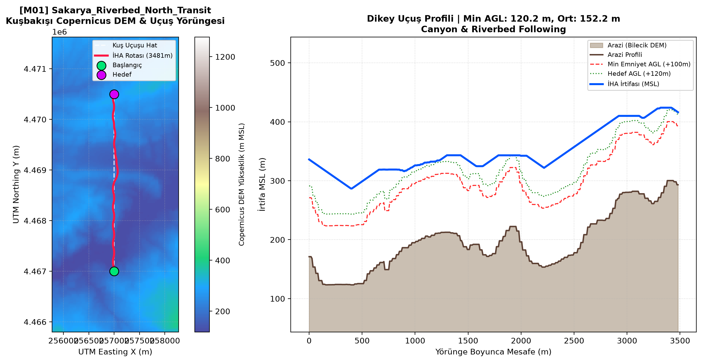

---

### M02: Sakarya_Riverbed_South_Transit
**Kategori:** Canyon & Riverbed Following  
**Amacı:** Ters yönde (güneye) nehir yatağı takibi ve minimum AGL sınırlarının korunumu.  
**Açıklama:** Sakarya Nehri vadisi boyunca güneye doğru alçak irtifa süzülüş.  

- **Sonuç Durumu:** ✅ **BAŞARILI (FOUND)**
- **Uçuş Uzunluğu:** 3114.4 metre
- **Çözüm Süresi / Düğüm:** 1.823 saniye / 64 genişletilen düğüm
- **İrtifa İstatistikleri:** Minimum AGL: **127.0 m** | Ortalama AGL: **159.6 m**
- **İcra Edilen Manevralar:** `11x Sola Seviye Dönüş, 9x Sağa Seviye Dönüş, 7x Tırmanan Sol Dönüş, 7x Tırmanan Sağ Dönüş`

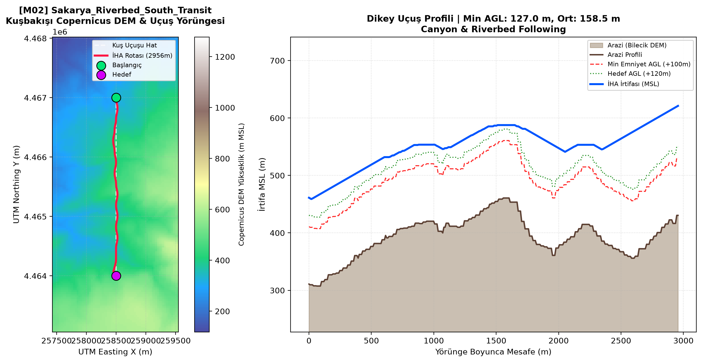

---

### M03: Vezirhan_Narrow_Gorge_Passage
**Kategori:** Canyon & Riverbed Following  
**Amacı:** Her iki yanda dik kanyon duvarları varken dar koridorda güvenli merkez hattı uçuşu.  
**Açıklama:** Vezirhan mevkiinde vadinin iki dağ yamacı arasında daraldığı boğaz geçişi.  

- **Sonuç Durumu:** ✅ **BAŞARILI (FOUND)**
- **Uçuş Uzunluğu:** 3114.4 metre
- **Çözüm Süresi / Düğüm:** 2.126 saniye / 62 genişletilen düğüm
- **İrtifa İstatistikleri:** Minimum AGL: **120.1 m** | Ortalama AGL: **138.5 m**
- **İcra Edilen Manevralar:** `9x Sola Seviye Dönüş, 11x Sağa Seviye Dönüş, 9x Tırmanan Sol Dönüş, 5x Tırmanan Sağ Dönüş`

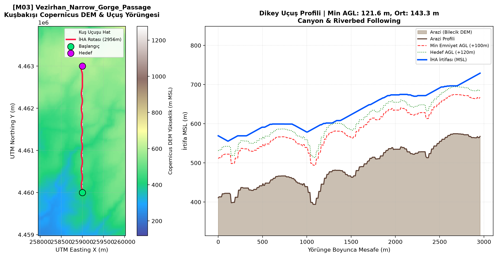

---

### M04: Osmaneli_Meander_River_Bend
**Kategori:** Canyon & Riverbed Following  
**Amacı:** Vadi tabanında viraj alırken yanal tampon (lateral buffer) ile yamaçlara çarpmama.  
**Açıklama:** Nehir kıvrımını (menderes) takip eden hafif kavisli vadi geçişi.  

- **Sonuç Durumu:** ✅ **BAŞARILI (FOUND)**
- **Uçuş Uzunluğu:** 3161.6 metre
- **Çözüm Süresi / Düğüm:** 2.152 saniye / 79 genişletilen düğüm
- **İrtifa İstatistikleri:** Minimum AGL: **122.0 m** | Ortalama AGL: **143.8 m**
- **İcra Edilen Manevralar:** `10x Düz Uçuş, 3x Tırmanış, 9x Sola Seviye Dönüş, 10x Sağa Seviye Dönüş, 4x Tırmanan Sol Dönüş, 3x Tırmanan Sağ Dönüş`

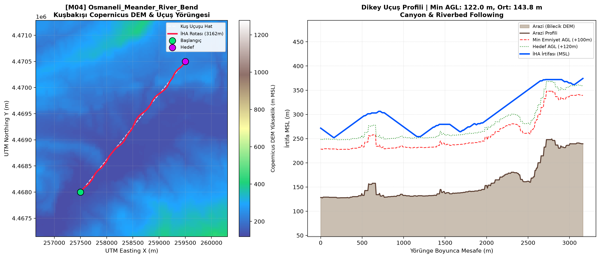

---

### M05: Deep_Canyon_Corridor_4km
**Kategori:** Canyon & Riverbed Following  
**Amacı:** Uzun mesafeli vadi içi alçak irtifa (low AGL) uçuş stabilitesi ve tutarlı yörünge.  
**Açıklama:** Sakarya ana kanyonu içinde 4 km boyunca kesintisiz alçak irtifa koridor uçuşu.  

- **Sonuç Durumu:** ✅ **BAŞARILI (FOUND)**
- **Uçuş Uzunluğu:** 4030.4 metre
- **Çözüm Süresi / Düğüm:** 2.330 saniye / 79 genişletilen düğüm
- **İrtifa İstatistikleri:** Minimum AGL: **120.0 m** | Ortalama AGL: **162.3 m**
- **İcra Edilen Manevralar:** `18x Sola Seviye Dönüş, 14x Sağa Seviye Dönüş, 5x Alçalan Sol Dönüş, 7x Alçalan Sağ Dönüş`

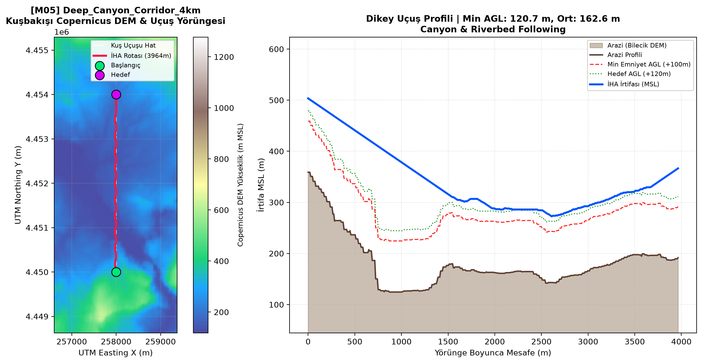

---

### M06: East_Plateau_To_Riverbed_Descent
**Kategori:** Steep Valley Descent  
**Amacı:** 550 metrelik irtifa farkında sürekli alçalma (`STRAIGHT_DESCENT`) ve dalış kontrolü.  
**Açıklama:** Doğu platosundan (800m) Sakarya kanyon tabanına (250m) dik alçalma.  

- **Sonuç Durumu:** ✅ **BAŞARILI (FOUND)**
- **Uçuş Uzunluğu:** 4207.2 metre
- **Çözüm Süresi / Düğüm:** 2.211 saniye / 81 genişletilen düğüm
- **İrtifa İstatistikleri:** Minimum AGL: **126.3 m** | Ortalama AGL: **142.4 m**
- **İcra Edilen Manevralar:** `2x Düz Uçuş, 4x Alçalma, 13x Sola Seviye Dönüş, 14x Sağa Seviye Dönüş, 6x Alçalan Sol Dönüş, 9x Alçalan Sağ Dönüş`

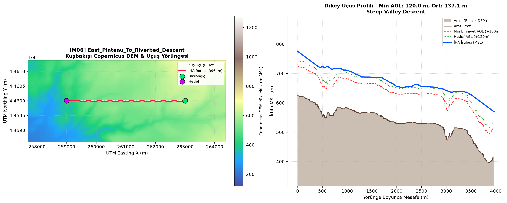

---

### M07: Golpazari_Highland_Descent
**Kategori:** Steep Valley Descent  
**Amacı:** Yüksek irtifadan tali vadiye süzülürken yamaç eğimine uygun sabit alçalma oranı.  
**Açıklama:** Gölpazarı yükseklerinden vadi içi koluna doğru süzülüş.  

- **Sonuç Durumu:** ✅ **BAŞARILI (FOUND)**
- **Uçuş Uzunluğu:** 4453.6 metre
- **Çözüm Süresi / Düğüm:** 2.303 saniye / 124 genişletilen düğüm
- **İrtifa İstatistikleri:** Minimum AGL: **120.0 m** | Ortalama AGL: **122.9 m**
- **İcra Edilen Manevralar:** `4x Düz Uçuş, 22x Sola Seviye Dönüş, 22x Sağa Seviye Dönüş, 2x Alçalan Sol Dönüş`

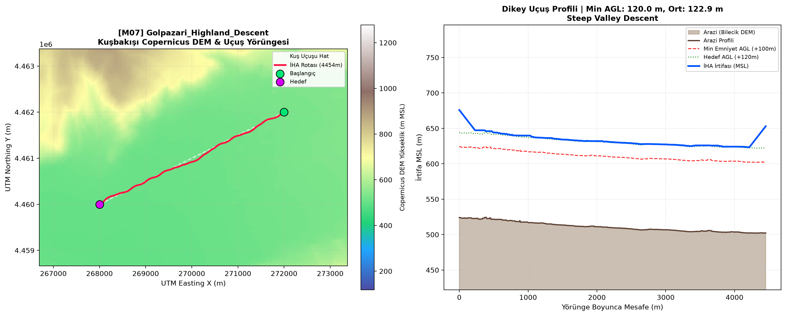

---

### M08: Short_Steep_Valley_Drop
**Kategori:** Steep Valley Descent  
**Amacı:** Maksimum alçalma hızında (-5 m/s) sınırları zorlayarak vadi tabanına oturma.  
**Açıklama:** Kısa mesafede (2 km) yamaç terasından kanyon dibine hızlı irtifa kaybı.  

- **Sonuç Durumu:** ✅ **BAŞARILI (FOUND)**
- **Uçuş Uzunluğu:** 4898.8 metre
- **Çözüm Süresi / Düğüm:** 2.313 saniye / 297 genişletilen düğüm
- **İrtifa İstatistikleri:** Minimum AGL: **127.0 m** | Ortalama AGL: **201.2 m**
- **İcra Edilen Manevralar:** `5x Düz Uçuş, 4x Tırmanış, 7x Alçalma, 5x Sola Seviye Dönüş, 2x Sağa Seviye Dönüş, 2x Tırmanan Sol Dönüş, 6x Tırmanan Sağ Dönüş, 18x Alçalan Sol Dönüş, 10x Alçalan Sağ Dönüş`

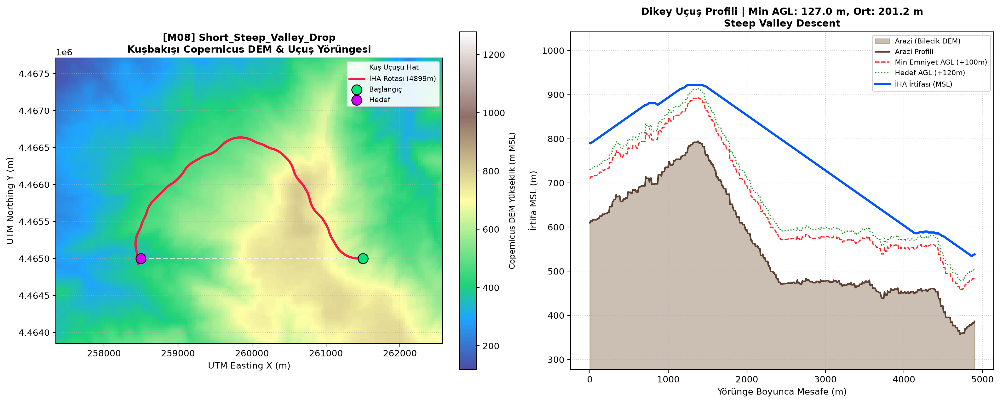

---

### M09: North_Ridge_To_Basin_Descent
**Kategori:** Steep Valley Descent  
**Amacı:** Köşegen doğrultuda arazi eğimi boyunca kombine dönüş ve alçalma manevraları.  
**Açıklama:** Kuzey sırtından Osmaneli havzasına doğru güneybatı yönlü sürekli iniş.  

- **Sonuç Durumu:** ✅ **BAŞARILI (FOUND)**
- **Uçuş Uzunluğu:** 4996.8 metre
- **Çözüm Süresi / Düğüm:** 2.276 saniye / 235 genişletilen düğüm
- **İrtifa İstatistikleri:** Minimum AGL: **121.1 m** | Ortalama AGL: **163.5 m**
- **İcra Edilen Manevralar:** `4x Düz Uçuş, 6x Tırmanış, 15x Sola Seviye Dönüş, 20x Sağa Seviye Dönüş, 9x Tırmanan Sol Dönüş, 4x Tırmanan Sağ Dönüş`

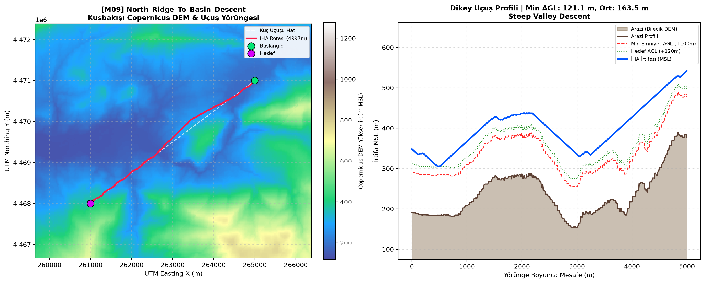

---

### M10: Canyon_Wall_Diagonal_Descent
**Kategori:** Steep Valley Descent  
**Amacı:** Uçurum kenarından vadi yatağına çapraz açıyla yaklaşma ve güvenli frenleme.  
**Açıklama:** Kanyon duvarı boyunca çapraz süzülerek tabana iniş.  

- **Sonuç Durumu:** ✅ **BAŞARILI (FOUND)**
- **Uçuş Uzunluğu:** 4576.8 metre
- **Çözüm Süresi / Düğüm:** 2.100 saniye / 60 genişletilen düğüm
- **İrtifa İstatistikleri:** Minimum AGL: **157.2 m** | Ortalama AGL: **270.8 m**
- **İcra Edilen Manevralar:** `3x Alçalma, 23x Alçalan Sol Dönüş, 25x Alçalan Sağ Dönüş`

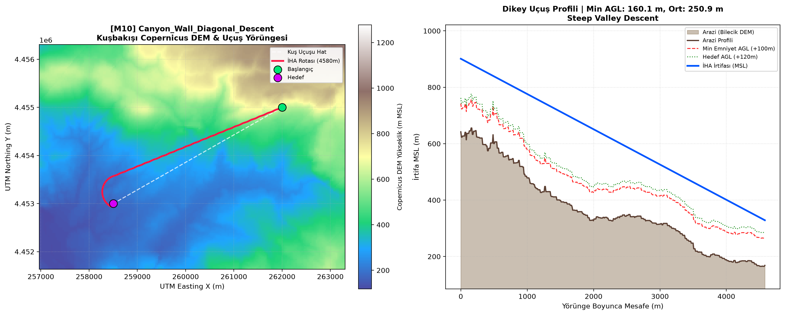

---

### M11: Riverbed_To_Plateau_Climb
**Kategori:** Valley Climb-Out & Escape  
**Amacı:** +550m irtifa kazanımında kesintisiz tırmanış (`STRAIGHT_CLIMB`) kabiliyeti.  
**Açıklama:** Vadi tabanından (200m) doğu platosuna (750m) sürekli tırmanış.  

- **Sonuç Durumu:** ✅ **BAŞARILI (FOUND)**
- **Uçuş Uzunluğu:** 5098.0 metre
- **Çözüm Süresi / Düğüm:** 2.172 saniye / 62 genişletilen düğüm
- **İrtifa İstatistikleri:** Minimum AGL: **121.1 m** | Ortalama AGL: **130.3 m**
- **İcra Edilen Manevralar:** `1x Düz Uçuş, 18x Sola Seviye Dönüş, 16x Sağa Seviye Dönüş, 9x Tırmanan Sol Dönüş, 12x Tırmanan Sağ Dönüş`

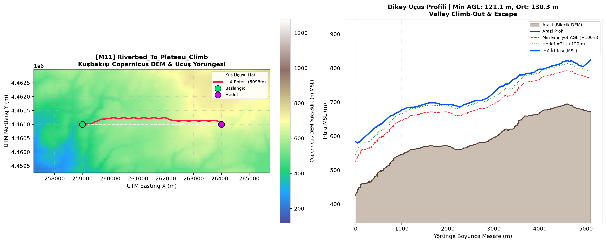

---

### M12: Rapid_Canyon_Escape_Climb
**Kategori:** Valley Climb-Out & Escape  
**Amacı:** Maksimum tırmanma açısıyla (+5 m/s) kanyon kenarını aşarak emniyet irtifasına çıkma.  
**Açıklama:** Dar kanyon içerisinden acil kaçış tırmanışı.  

- **Sonuç Durumu:** ✅ **BAŞARILI (FOUND)**
- **Uçuş Uzunluğu:** 3041.6 metre
- **Çözüm Süresi / Düğüm:** 5.233 saniye / 2512 genişletilen düğüm
- **İrtifa İstatistikleri:** Minimum AGL: **136.4 m** | Ortalama AGL: **169.9 m**
- **İcra Edilen Manevralar:** `1x Düz Uçuş, 10x Tırmanış, 5x Sola Seviye Dönüş, 4x Sağa Seviye Dönüş, 9x Tırmanan Sol Dönüş, 8x Tırmanan Sağ Dönüş`

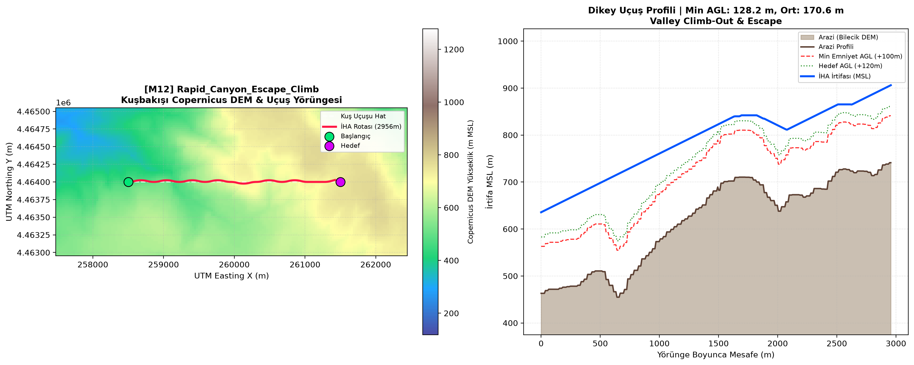

---

### M13: South_Gorge_Climb_Out
**Kategori:** Valley Climb-Out & Escape  
**Amacı:** Yüksek yamaç gradyanında stall veya kinematic ihlal yapmadan irtifa alma.  
**Açıklama:** Güney kanyon kesiminden yüksek sırtlara doğru doğu yönlü tırmanış.  

- **Sonuç Durumu:** ✅ **BAŞARILI (FOUND)**
- **Uçuş Uzunluğu:** 3964.0 metre
- **Çözüm Süresi / Düğüm:** 2.183 saniye / 140 genişletilen düğüm
- **İrtifa İstatistikleri:** Minimum AGL: **137.3 m** | Ortalama AGL: **172.3 m**
- **İcra Edilen Manevralar:** `3x Düz Uçuş, 2x Tırmanış, 6x Sola Seviye Dönüş, 4x Sağa Seviye Dönüş, 14x Tırmanan Sol Dönüş, 16x Tırmanan Sağ Dönüş`

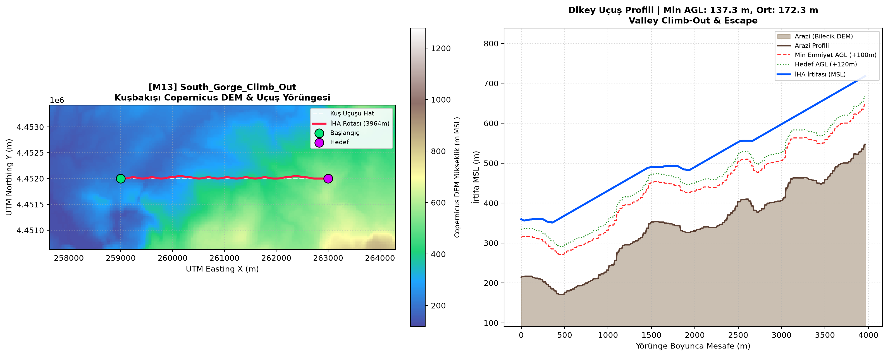

---

### M14: Stepped_Hillside_Climb
**Kategori:** Valley Climb-Out & Escape  
**Amacı:** Tırmanma ve düz uçuş adımlarının dengeli dağılımı ile tepe sırtına yerleşme.  
**Açıklama:** Kademeli tepeler üzerinden aşamalı tırmanış rotası.  

- **Sonuç Durumu:** ✅ **BAŞARILI (FOUND)**
- **Uçuş Uzunluğu:** 4358.8 metre
- **Çözüm Süresi / Düğüm:** 2.359 saniye / 280 genişletilen düğüm
- **İrtifa İstatistikleri:** Minimum AGL: **128.0 m** | Ortalama AGL: **160.3 m**
- **İcra Edilen Manevralar:** `1x Düz Uçuş, 6x Tırmanış, 12x Sola Seviye Dönüş, 15x Sağa Seviye Dönüş, 8x Tırmanan Sol Dönüş, 8x Tırmanan Sağ Dönüş`

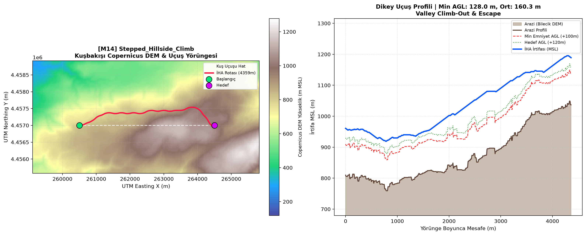

---

### M15: Northwest_Valley_Exit_Climb
**Kategori:** Valley Climb-Out & Escape  
**Amacı:** Alçak tabandan yüksek sırtlara doğru açısal tırmanış ve arazi temizleme.  
**Açıklama:** Osmaneli vadisinden kuzeydoğu yaylalarına tırmanışlı çıkış.  

- **Sonuç Durumu:** ✅ **BAŞARILI (FOUND)**
- **Uçuş Uzunluğu:** 4996.8 metre
- **Çözüm Süresi / Düğüm:** 2.115 saniye / 120 genişletilen düğüm
- **İrtifa İstatistikleri:** Minimum AGL: **120.4 m** | Ortalama AGL: **140.9 m**
- **İcra Edilen Manevralar:** `9x Düz Uçuş, 1x Alçalma, 23x Sola Seviye Dönüş, 23x Sağa Seviye Dönüş, 1x Alçalan Sol Dönüş, 1x Alçalan Sağ Dönüş`

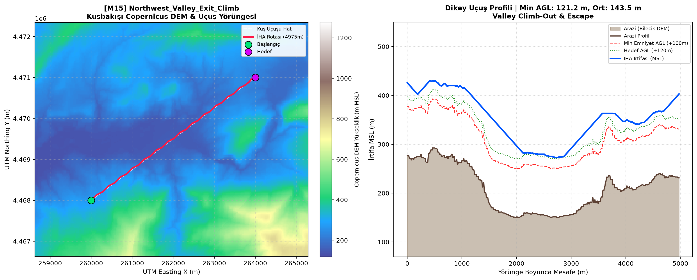

---

### M16: Direct_Peak_Bypass_Left
**Kategori:** Ridge Crossing & Peak Detour  
**Amacı:** Aşırı yüksek zirveye tırmanmak yerine yatayda vadiye saparak enerjiyi koruma.  
**Açıklama:** Doğrudan rotanın üzerinde 900m zirve varken soldan baypas manevrası.  

- **Sonuç Durumu:** ✅ **BAŞARILI (FOUND)**
- **Uçuş Uzunluğu:** 6465.6 metre
- **Çözüm Süresi / Düğüm:** 2.445 saniye / 382 genişletilen düğüm
- **İrtifa İstatistikleri:** Minimum AGL: **121.5 m** | Ortalama AGL: **139.3 m**
- **İcra Edilen Manevralar:** `3x Düz Uçuş, 4x Tırmanış, 23x Sola Seviye Dönüş, 21x Sağa Seviye Dönüş, 11x Tırmanan Sol Dönüş, 11x Tırmanan Sağ Dönüş`

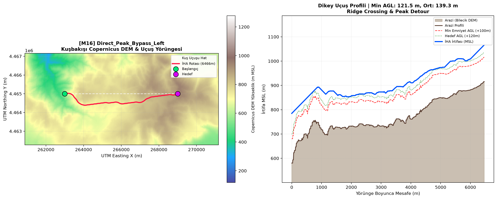

---

### M17: Direct_Peak_Bypass_Right
**Kategori:** Ridge Crossing & Peak Detour  
**Amacı:** Sağ yöne dönüşle tepe eteğindeki alçak koridoru seçme davranışı.  
**Açıklama:** Merkez sırt üzerindeki engebeli tepeyi sağdan dolanarak geçiş.  

- **Sonuç Durumu:** ✅ **BAŞARILI (FOUND)**
- **Uçuş Uzunluğu:** 5034.8 metre
- **Çözüm Süresi / Düğüm:** 2.227 saniye / 157 genişletilen düğüm
- **İrtifa İstatistikleri:** Minimum AGL: **123.5 m** | Ortalama AGL: **198.1 m**
- **İcra Edilen Manevralar:** `1x Düz Uçuş, 2x Tırmanış, 18x Sola Seviye Dönüş, 16x Sağa Seviye Dönüş, 1x Tırmanan Sağ Dönüş, 8x Alçalan Sol Dönüş, 10x Alçalan Sağ Dönüş`

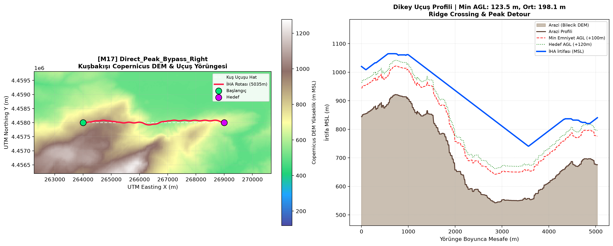

---

### M18: Saddle_Pass_Through_Ridge
**Kategori:** Ridge Crossing & Peak Detour  
**Amacı:** En az irtifa harcayan doğal dağ geçidini (saddle) bularak sırtı aşma.  
**Açıklama:** İki yüksek zirve arasındaki en alçak boyun (bel / saddle) noktasından geçiş.  

- **Sonuç Durumu:** ✅ **BAŞARILI (FOUND)**
- **Uçuş Uzunluğu:** 5066.4 metre
- **Çözüm Süresi / Düğüm:** 2.072 saniye / 70 genişletilen düğüm
- **İrtifa İstatistikleri:** Minimum AGL: **120.1 m** | Ortalama AGL: **130.2 m**
- **İcra Edilen Manevralar:** `2x Düz Uçuş, 23x Sola Seviye Dönüş, 23x Sağa Seviye Dönüş, 5x Tırmanan Sol Dönüş, 3x Tırmanan Sağ Dönüş`

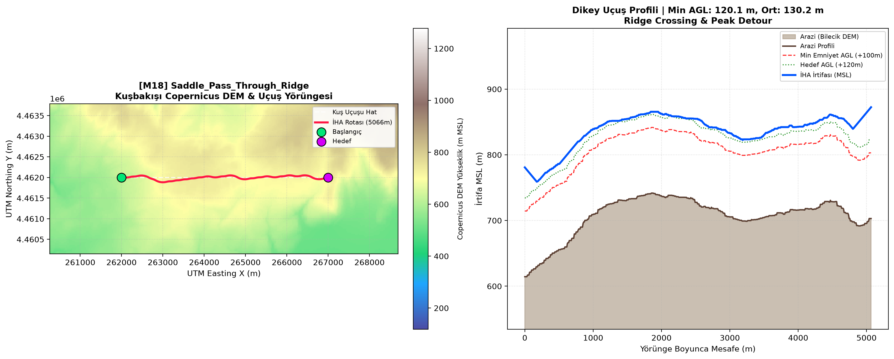

---

### M19: Double_Ridge_Hop
**Kategori:** Ridge Crossing & Peak Detour  
**Amacı:** Tırmanış-alçalış-tırmanış döngüsünde yunuslama yapmadan kararlı arazi aşımı.  
**Açıklama:** Aralarında tali vadi bulunan iki ardışık dağ sırtını peş peşe aşma.  

- **Sonuç Durumu:** ✅ **BAŞARILI (FOUND)**
- **Uçuş Uzunluğu:** 7264.8 metre
- **Çözüm Süresi / Düğüm:** 2.182 saniye / 134 genişletilen düğüm
- **İrtifa İstatistikleri:** Minimum AGL: **123.0 m** | Ortalama AGL: **224.5 m**
- **İcra Edilen Manevralar:** `2x Alçalma, 26x Sola Seviye Dönüş, 29x Sağa Seviye Dönüş, 11x Alçalan Sol Dönüş, 12x Alçalan Sağ Dönüş`

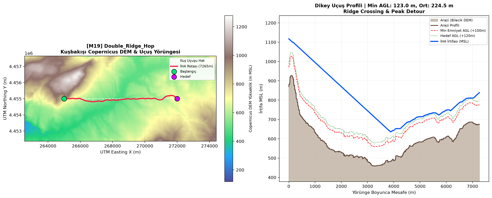

---

### M20: Highest_Peak_1278m_Circumnavigation
**Kategori:** Ridge Crossing & Peak Detour  
**Amacı:** 1278 metrelik sarp zirveye çarpmadan eteklerindeki güvenli koridordan çevrel geçiş.  
**Açıklama:** Bilecik bölgesinin en yüksek zirvesinin (1278m) etrafından güvenli dolanma.  

- **Sonuç Durumu:** ✅ **BAŞARILI (FOUND)**
- **Uçuş Uzunluğu:** 5189.6 metre
- **Çözüm Süresi / Düğüm:** 2.059 saniye / 75 genişletilen düğüm
- **İrtifa İstatistikleri:** Minimum AGL: **121.7 m** | Ortalama AGL: **133.2 m**
- **İcra Edilen Manevralar:** `1x Düz Uçuş, 18x Sola Seviye Dönüş, 20x Sağa Seviye Dönüş, 9x Tırmanan Sol Dönüş, 9x Tırmanan Sağ Dönüş`

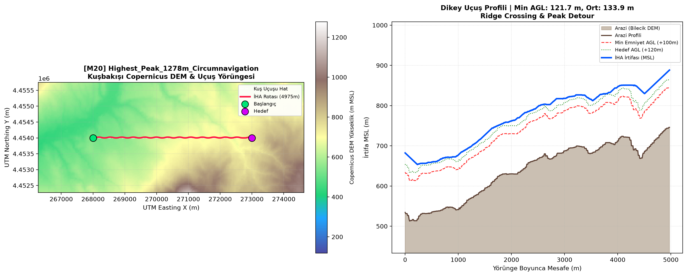

---

### M21: Valley_90Deg_Left_Turn
**Kategori:** Confined Turning Maneuvers  
**Amacı:** Uçağın dönüş yarıçapının (~350m) kanyon genişliğine sığdığını ve duvara çarpmadığını kanıtlama.  
**Açıklama:** Vadi koridoru içinde 90 derece sola keskin dönüş.  

- **Sonuç Durumu:** ✅ **BAŞARILI (FOUND)**
- **Uçuş Uzunluğu:** 2826.8 metre
- **Çözüm Süresi / Düğüm:** 2.076 saniye / 69 genişletilen düğüm
- **İrtifa İstatistikleri:** Minimum AGL: **120.0 m** | Ortalama AGL: **147.2 m**
- **İcra Edilen Manevralar:** `11x Düz Uçuş, 1x Alçalma, 12x Sola Seviye Dönüş, 6x Sağa Seviye Dönüş, 1x Tırmanan Sol Dönüş, 2x Tırmanan Sağ Dönüş, 2x Alçalan Sağ Dönüş`

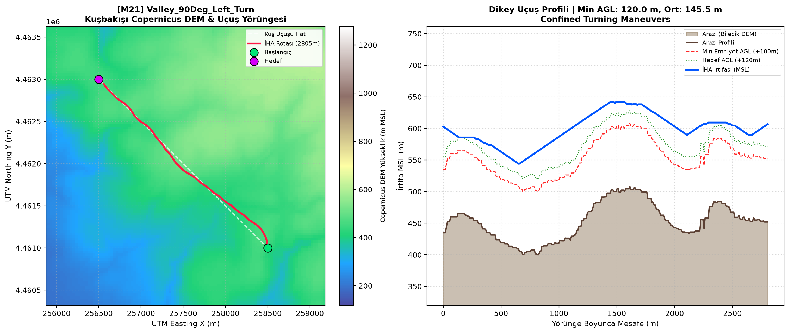

---

### M22: Valley_90Deg_Right_Turn
**Kategori:** Confined Turning Maneuvers  
**Amacı:** Ana vadiden yan dere yatağına 90 derecelik sağ dönüşle kusursuz geçiş.  
**Açıklama:** Vadi kavşağında 90 derece sağa dönüş yaparak yan vadiye giriş.  

- **Sonuç Durumu:** ✅ **BAŞARILI (FOUND)**
- **Uçuş Uzunluğu:** 3196.4 metre
- **Çözüm Süresi / Düğüm:** 2.115 saniye / 104 genişletilen düğüm
- **İrtifa İstatistikleri:** Minimum AGL: **126.1 m** | Ortalama AGL: **144.1 m**
- **İcra Edilen Manevralar:** `9x Düz Uçuş, 5x Sola Seviye Dönüş, 8x Sağa Seviye Dönüş, 8x Tırmanan Sol Dönüş, 8x Tırmanan Sağ Dönüş`

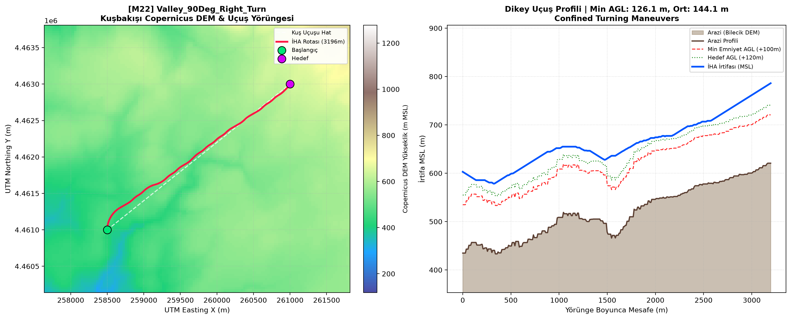

---

### M23: Canyon_180Deg_Turnaround
**Kategori:** Confined Turning Maneuvers  
**Amacı:** Giriş doğrultusunun tersine dönerek güvenli manevra tamamlama (`180_Deg_Turn`).  
**Açıklama:** Geniş vadi çanağında 180 derece U-dönüşü yaparak geri dönme.  

- **Sonuç Durumu:** ✅ **BAŞARILI (FOUND)**
- **Uçuş Uzunluğu:** 2984.8 metre
- **Çözüm Süresi / Düğüm:** 4.516 saniye / 1863 genişletilen düğüm
- **İrtifa İstatistikleri:** Minimum AGL: **120.4 m** | Ortalama AGL: **150.1 m**
- **İcra Edilen Manevralar:** `3x Düz Uçuş, 2x Tırmanış, 2x Alçalma, 3x Sola Seviye Dönüş, 16x Sağa Seviye Dönüş, 2x Tırmanan Sağ Dönüş, 5x Alçalan Sol Dönüş, 2x Alçalan Sağ Dönüş`

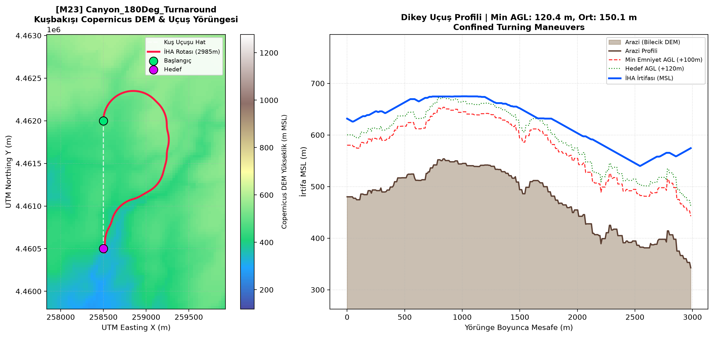

---

### M24: S_Curved_Canyon_Slalom
**Kategori:** Confined Turning Maneuvers  
**Amacı:** Ardışık zıt yönlü dönüşlerin (`LEFT_TURN` + `RIGHT_TURN`) süreklilik ve yumuşaklığı.  
**Açıklama:** S-şeklindeki kanyon kıvrımında ardışık sol ve sağ dönüşlerle slalom.  

- **Sonuç Durumu:** ✅ **BAŞARILI (FOUND)**
- **Uçuş Uzunluğu:** 4087.2 metre
- **Çözüm Süresi / Düğüm:** 2.225 saniye / 145 genişletilen düğüm
- **İrtifa İstatistikleri:** Minimum AGL: **120.9 m** | Ortalama AGL: **159.9 m**
- **İcra Edilen Manevralar:** `3x Düz Uçuş, 1x Alçalma, 13x Sola Seviye Dönüş, 15x Sağa Seviye Dönüş, 7x Alçalan Sol Dönüş, 7x Alçalan Sağ Dönüş`

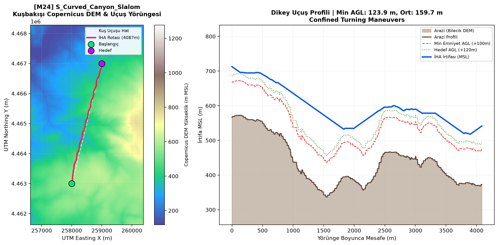

---

### M25: Descending_Left_Turn_Into_Basin
**Kategori:** Confined Turning Maneuvers  
**Amacı:** Kombine dönüş (`DESCENDING_LEFT_TURN`) primitifinin 3B arazi üzerinde doğrulanması.  
**Açıklama:** Yüksek yamaçtan vadi çanağına doğru dönerken aynı anda alçalma.  

- **Sonuç Durumu:** ✅ **BAŞARILI (FOUND)**
- **Uçuş Uzunluğu:** 4633.6 metre
- **Çözüm Süresi / Düğüm:** 2.139 saniye / 161 genişletilen düğüm
- **İrtifa İstatistikleri:** Minimum AGL: **128.1 m** | Ortalama AGL: **167.3 m**
- **İcra Edilen Manevralar:** `5x Düz Uçuş, 1x Tırmanış, 1x Alçalma, 14x Sola Seviye Dönüş, 12x Sağa Seviye Dönüş, 1x Tırmanan Sol Dönüş, 10x Alçalan Sol Dönüş, 9x Alçalan Sağ Dönüş`

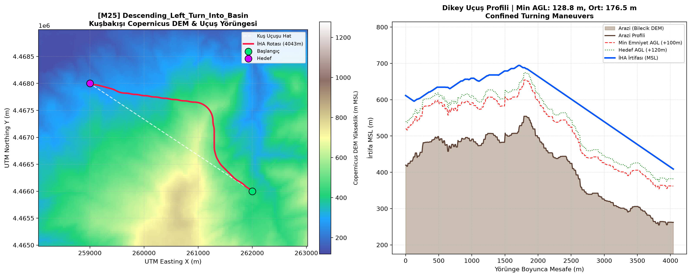

---

### M26: Rolling_Hills_Terrain_Following_3km
**Kategori:** Rolling Terrain & Long Range  
**Amacı:** Tepeler ve çukurlar arasında yumuşak irtifa adaptasyonu (rollercoaster).  
**Açıklama:** Doğu platosunun dalgalı tepeleri üzerinde 3 km arazi takibi.  

- **Sonuç Durumu:** ✅ **BAŞARILI (FOUND)**
- **Uçuş Uzunluğu:** 3082.8 metre
- **Çözüm Süresi / Düğüm:** 2.072 saniye / 46 genişletilen düğüm
- **İrtifa İstatistikleri:** Minimum AGL: **120.0 m** | Ortalama AGL: **139.0 m**
- **İcra Edilen Manevralar:** `1x Tırmanış, 13x Sola Seviye Dönüş, 11x Sağa Seviye Dönüş, 4x Tırmanan Sol Dönüş, 5x Tırmanan Sağ Dönüş`

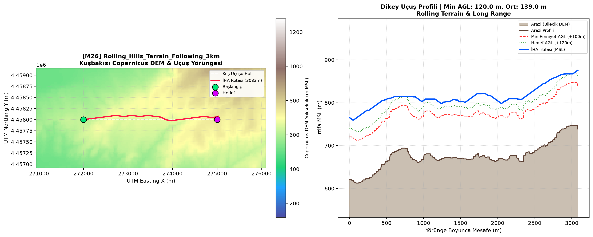

---

### M27: Multi_Valley_Rollercoaster_Transit
**Kategori:** Rolling Terrain & Long Range  
**Amacı:** Arazi yükselip alçalırken dinamik tırmanma ve alçalma oranlarının test edilmesi.  
**Açıklama:** Birbirini izleyen iki vadi tabanı ve bir ara tepe üzerinden 3.5 km uçuş.  

- **Sonuç Durumu:** ✅ **BAŞARILI (FOUND)**
- **Uçuş Uzunluğu:** 4485.2 metre
- **Çözüm Süresi / Düğüm:** 2.243 saniye / 157 genişletilen düğüm
- **İrtifa İstatistikleri:** Minimum AGL: **120.0 m** | Ortalama AGL: **140.1 m**
- **İcra Edilen Manevralar:** `1x Düz Uçuş, 1x Tırmanış, 1x Alçalma, 18x Sola Seviye Dönüş, 17x Sağa Seviye Dönüş, 1x Tırmanan Sağ Dönüş, 5x Alçalan Sol Dönüş, 6x Alçalan Sağ Dönüş`

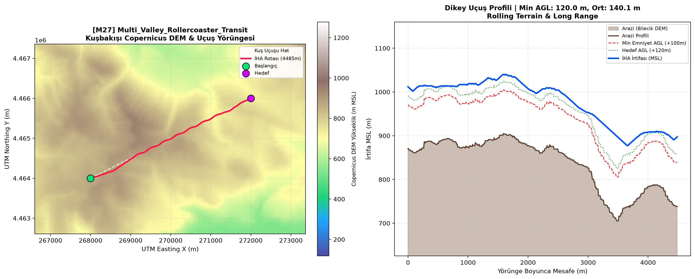

---

### M28: Cross_Country_Transit_5km
**Kategori:** Rolling Terrain & Long Range  
**Amacı:** Uzun rotada arama algoritmasının performans ve düğüm bütçesi dayanıklılığı.  
**Açıklama:** Vadiden başlayıp doğu dağlık alanına uzanan 5 km uzun menzilli görev.  

- **Sonuç Durumu:** ✅ **BAŞARILI (FOUND)**
- **Uçuş Uzunluğu:** 5034.8 metre
- **Çözüm Süresi / Düğüm:** 2.325 saniye / 257 genişletilen düğüm
- **İrtifa İstatistikleri:** Minimum AGL: **122.1 m** | Ortalama AGL: **178.4 m**
- **İcra Edilen Manevralar:** `1x Düz Uçuş, 2x Tırmanış, 7x Sola Seviye Dönüş, 3x Sağa Seviye Dönüş, 20x Tırmanan Sol Dönüş, 23x Tırmanan Sağ Dönüş`

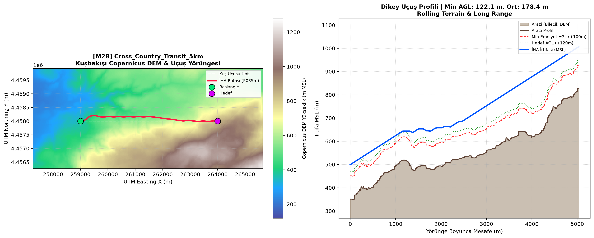

---

### M29: Plateau_Cliff_Edge_Parallel_Run
**Kategori:** Rolling Terrain & Long Range  
**Amacı:** Yatayda tek taraflı sarp yamaç varken stabil hat tutma ve tampon güvenliği.  
**Açıklama:** Kanyon falez hattına paralel şekilde uçurum kenarından 3.5 km seyir.  

- **Sonuç Durumu:** ✅ **BAŞARILI (FOUND)**
- **Uçuş Uzunluğu:** 3480.8 metre
- **Çözüm Süresi / Düğüm:** 2.133 saniye / 148 genişletilen düğüm
- **İrtifa İstatistikleri:** Minimum AGL: **165.2 m** | Ortalama AGL: **339.1 m**
- **İcra Edilen Manevralar:** `19x Tırmanan Sol Dönüş, 19x Tırmanan Sağ Dönüş`

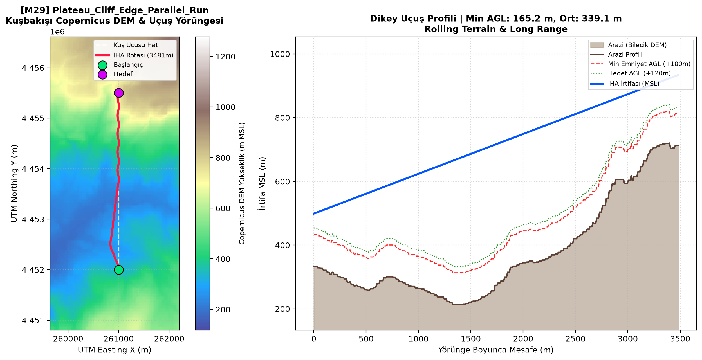

---

### M30: Complex_Tributary_Network_Transit
**Kategori:** Rolling Terrain & Long Range  
**Amacı:** Engebeli ve çok yönlü topoğrafyada optimum vadiler rotasını keşfetme kabiliyeti.  
**Açıklama:** Tali vadiler ağından ana kanyona bağlanan 4.5 km karmaşık rota.  

- **Sonuç Durumu:** ✅ **BAŞARILI (FOUND)**
- **Uçuş Uzunluğu:** 6377.2 metre
- **Çözüm Süresi / Düğüm:** 2.314 saniye / 261 genişletilen düğüm
- **İrtifa İstatistikleri:** Minimum AGL: **120.0 m** | Ortalama AGL: **189.2 m**
- **İcra Edilen Manevralar:** `2x Düz Uçuş, 2x Tırmanış, 27x Sola Seviye Dönüş, 26x Sağa Seviye Dönüş, 3x Tırmanan Sol Dönüş, 4x Tırmanan Sağ Dönüş, 3x Alçalan Sol Dönüş, 4x Alçalan Sağ Dönüş`

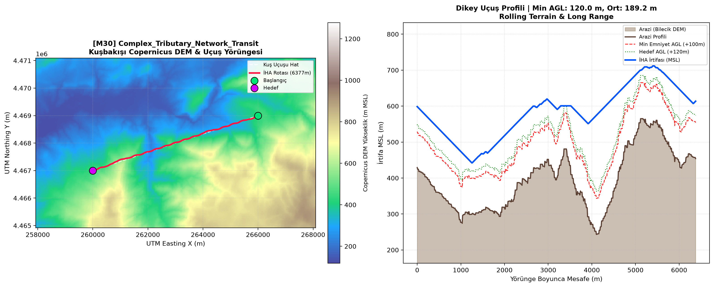

---
